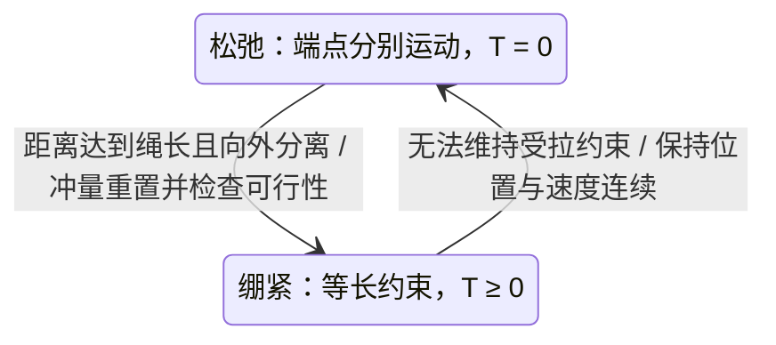

# RotorTM 详解：吊载动力学、混合切换与冲击求解

整理日期：2026-09-14。

RotorTM 最值得 CSim 借鉴的内容，是把无人机与载荷的连续运动、绳索模式切换以及收紧瞬间的速度重置放在同一个物理框架中。特别是多机共同吊运刚体时，它联合处理载荷线速度、角速度和各无人机速度的变化。

本文是一份阅读与建模笔记，不是论文译文。论文结论标注原文章节；其余力学推导使用本文统一符号，算例和 CSim 实施建议为本项目的分析。本文不代表已经实现 RotorTM 或松紧绳运行时。

## 1. 文献与阅读路线

- Guanrui Li、Xinyang Liu、Giuseppe Loianno：*RotorTM: A Flexible Simulator for Aerial Transportation and Manipulation*。
- IEEE Transactions on Robotics，2024，卷 40，831–850；[DOI](https://doi.org/10.1109/TRO.2023.3336320)。DOI 中的 2023 不等于最终卷期年份。
- 公式定位采用 [arXiv v3，2024-01-09](https://arxiv.org/html/2205.05140v3)，[PDF](https://arxiv.org/pdf/2205.05140v3)，[版本信息](https://arxiv.org/abs/2205.05140)。
- 软件接口以[作者代码仓库](https://github.com/arplaboratory/RotorTM)公开说明为依据；本文没有逐行审计或运行外部仓库，不对具体提交的实现正确性作保证。

| 阅读目标 | 原文定位 | 本文对应内容 |
| --- | --- | --- |
| 看清系统范围、状态和模块 | §III、表 I–II、式 (1)–(6) | 第 2–3 节 |
| 单机和多机连续动力学 | §IV、式 (7)–(26) | 第 4、7 节 |
| 单机收紧后的速度 | §V-A、式 (27)–(34) | 第 5–6 节 |
| 多绳冲击的联合求解 | §V-B、式 (35)–(57)、Theorem 1 | 第 8 节 |
| 轨迹与控制 | §VI、式 (58)–(74) | 第 9 节 |
| 实验检验了什么 | §VII-A/B、图 13–20 | 第 10 节 |
| 应如何用于 CSim | 本项目分析 | 第 11–13 节 |

**章节勘误：**此前调研笔记将混合系统实验定位为“§VII-F”，应为 **§VII-B**。单机收紧是该节的仿真案例；松绳收紧的实机直接对比采用三机刚体吊载，不能称为单机和多机均完成了相同的实机冲击验证。

## 2. 核心内容及其适用范围

论文覆盖单机通过绳索悬挂质点、多机通过绳索悬挂刚体，以及多机刚性连接载荷。其主要研究贡献是多机绳索混合动力学的解析冲击模型，并用实机数据检验。连续模型忽略空气阻力、机间气动干扰，绳索无质量、挂在无人机质心，旋翼响应相对控制过程足够快；收紧采用不可伸长绳的完全非弹性冲击。[原文 §III–V](https://arxiv.org/html/2205.05140v3#S3)

这些假设决定了如何解释输出：

- 质点载荷没有姿态、惯性张量和角动量状态；刚体载荷有。
- 无质量绳没有自身的动量和振动波传播状态。
- 不可伸长绳只能约束端点距离，不能预测材料伸长。
- 质心挂点使绳力不直接产生无人机机体力矩；载荷侧偏心挂点仍会产生载荷力矩。
- 瞬时冲击得到冲量和速度变化；有限时间张力峰值需要额外的柔顺性模型。

这里的“多机”表示多架无人机在同一个耦合物理系统中协作。它与同时运行许多相互独立环境的批量并行，是不同层次的问题。

## 3. 统一坐标、符号与状态

采用 CSim 的局部 Z-up 惯性系 `W`。所有没有特殊标注的位置、线速度和力，都在 `W` 中表达。

| 符号 | 含义 |
| --- | --- |
| \(\mathbf e_3=(0,0,1)^T\) | 向上的世界坐标轴 |
| \(\mathbf g_W=-g\mathbf e_3\) | 实际重力加速度向量 |
| \(m_Q,m_L\) | 无人机和载荷质量 |
| \(\mathbf p_Q,\mathbf p_L\) | 无人机和载荷质心位置 |
| \(R_Q,R_L\) | 机体系、载荷体系到世界系的旋转矩阵 |
| \(J_Q,J_L\) | 各自体系中、关于各自质心的惯性矩阵 |
| \(\Omega_Q,\Omega_L\) | 在各自体系表达的刚体角速度 |
| \(f,\boldsymbol\tau_Q\) | 无人机总推力标量与机体系控制力矩 |
| \(\mathbf F_Q=fR_Q\mathbf e_3\) | 理想推力的世界系表达 |
| \(l\) | 不可伸长绳的长度 |
| \(d=\|\mathbf p_L-\mathbf p_Q\|\) | 两端直线距离 |
| \(\mathbf s=(\mathbf p_L-\mathbf p_Q)/d\) | 无人机指向载荷的方向，要求 \(d>0\) |
| \(T\) | 持续张力大小，单位 N |
| \(P\) | 收紧冲量大小，单位 N·s |

原文以 \(\boldsymbol\xi\) 表示这里的 \(\mathbf s\)，以 \(\mathbf g=+g\mathbf e_3\) 写在加速度等式左侧；本文把实际重力 \(\mathbf g_W\) 写在右侧。两种写法等价，不能把它们的重力符号混用。

叉乘矩阵定义为 \(\widehat{\mathbf a}\mathbf b=\mathbf a\times\mathbf b\)，于是

\[
\dot R_Q=R_Q\widehat{\Omega_Q},\qquad
J_Q\dot\Omega_Q+\Omega_Q\times(J_Q\Omega_Q)=\boldsymbol\tau_Q.
\]

位置加姿态给出刚体构型；线速度与角速度补齐微分方程的状态。加速度通常由当前状态和输入计算。理想冲击时速度可以跳变，此时不能用一个普通、有限的加速度数值描述整个瞬间。

单机混合模型可以保存

\[
X=(\mathbf p_Q,\mathbf v_Q,R_Q,\Omega_Q,\mathbf p_L,\mathbf v_L,\sigma),
\quad \sigma\in\{\mathrm{slack},\mathrm{taut}\}.
\]

这是本文建议的统一状态表达；绷紧时包含冗余量，但松弛时端点可以独立运动。当前 CSim 的“无人机状态＋绳方向＋绳角速度”只表示绷紧子空间，不能直接表达 \(d<l\)。

## 4. 从牛顿方程推导单机连续动力学

本节以质心挂接、质点载荷为前提，用受力平衡重新推导，便于核对原文 §IV-A 和 CSim 的符号。

### 4.1 先画清楚作用力

绳索沿两端连线拉住双方，对无人机施加 \(+T\mathbf s\)，对载荷施加 \(-T\mathbf s\)：

\[
m_Q\mathbf a_Q=m_Q\mathbf g_W+\mathbf F_Q+T\mathbf s,
\qquad
m_L\mathbf a_L=m_L\mathbf g_W-T\mathbf s.
\]

例如竖直悬挂时 \(\mathbf s=-\mathbf e_3\)，无人机受到向下绳力，载荷受到向上绳力。

### 4.2 松弛时分别运动

取 \(T=0\)，得到

\[
\mathbf a_Q=\mathbf g_W+\mathbf F_Q/m_Q,
\qquad \mathbf a_L=\mathbf g_W.
\]

载荷此时是抛体。若为 CSim 增加已有的空气作用力，载荷还会受到阻力；这属于模型扩展，不再是纯重力抛体。

### 4.3 绷紧时如何算张力

令 \(\mathbf r=\mathbf p_L-\mathbf p_Q\)、\(\mathbf v_r=\mathbf v_L-\mathbf v_Q\)。固定绳长给出

\[
\mathbf r^T\mathbf r=l^2.
\]

一次、二次求导分别得到

\[
\mathbf s^T\mathbf v_r=0,
\qquad
\mathbf s^T(\mathbf a_L-\mathbf a_Q)=-\frac{\|\mathbf v_r\|^2}{l}.
\]

注意右侧的向心项。绷紧只要求径向相对速度为零，并不要求两端完整速度相等；切向相对速度正是摆动。

定义约化质量

\[
\mu=\left(\frac1{m_Q}+\frac1{m_L}\right)^{-1}
=\frac{m_Qm_L}{m_Q+m_L}.
\]

代入受力方程可得维持绷紧所需的张力：

\[
\boxed{T_{\mathrm{required}}=
\mu\left(\frac{\|\mathbf v_r\|^2}{l}
-\frac{\mathbf s^T\mathbf F_Q}{m_Q}\right).}
\]

若该值为负，维持等长将要求绳索推开两端，已经超出绳模型的适用域。将其截成零后继续强制等长，不能解决矛盾；需要允许松弛运动。

悬停检查：\(\mathbf v_r=0\)、\(\mathbf s=-\mathbf e_3\)、\(f=(m_Q+m_L)g\)，代入得到 \(T=m_Lg\)，双方加速度为零。

### 4.4 为什么论文使用球面上的绳方向

绷紧时 \(\mathbf p_L=\mathbf p_Q+l\mathbf s\)，其中 \(\mathbf s\in S^2\)，只有两个独立自由度。由上式可推导

\[
(m_Q+m_L)(\mathbf a_L-\mathbf g_W)
=\left(\mathbf s^T\mathbf F_Q-m_Ql\|\dot{\mathbf s}\|^2\right)\mathbf s,
\]

\[
m_Ql\left(\ddot{\mathbf s}+\|\dot{\mathbf s}\|^2\mathbf s\right)
=\mathbf s\times(\mathbf s\times\mathbf F_Q).
\]

它们对应原文式 (10)–(11) 的统一符号表达：沿绳分量决定载荷加速度，垂直分量改变绳方向。[原文 §IV-A](https://arxiv.org/html/2205.05140v3#S4.SS1)

若定义 \(\dot{\mathbf s}=\boldsymbol\omega_c\times\mathbf s\)、\(\boldsymbol\omega_c^T\mathbf s=0\)，则

\[
\dot{\boldsymbol\omega}_c=-\frac{\mathbf s\times\mathbf F_Q}{m_Ql}.
\]

这与 CSim 当前绷紧模型的方向、绳角速度表示衔接。

### 4.5 CSim 风场扩展的受力入口

若把除重力、绳力之外的两端外力分别记为 \(\mathbf F_Q,\mathbf F_L\)，同样的推导给出

\[
T_{\mathrm{required}}=
\mu\left(\frac{\|\mathbf v_r\|^2}{l}
+\mathbf s^T\left(\frac{\mathbf F_L}{m_L}-\frac{\mathbf F_Q}{m_Q}\right)\right).
\]

这里无人机的 \(\mathbf F_Q\) 同时包含推力和空气力。该式说明可以在保持冲击处理边界清楚的同时扩展连续外力；SPAD、空气阻力和绳轴向阻尼仍应按各自物理定义分别处理。

## 5. 混合系统：连续运动与离散重置

“混合”表示一段时间内积分连续方程，到事件时刻执行模式或状态的离散变化。



图中是非退化切换；零速度、零张力边界还需单独判断。

原文式 (30) 的收紧条件为 \(d=l,\dot d>0\)，释放集合写为 \(d<l\)。释放是恒等重置，收紧改变速度。[原文 §V-A](https://arxiv.org/html/2205.05140v3#S5.SS1)

**实现上的推论：**若积分器严格维持 \(d=l\)，它不会自行产生 \(d<l\)，所以不能把原文释放集合直接作为 CSim 唯一的数值触发条件。应计算未截断的所需张力，在其失效时释放。

还需要明确以下边界：

- \(d=l,\dot d<0\)：端点正在靠近，应允许进入松弛。
- \(d=l,\dot d=0\)：不能只凭距离判模式，应判断自由运动是否将违反距离上限。
- \(d=0\)：松弛端点重合时不能归一化连线；松弛积分本身不需要绳方向。
- \(T=0\)：允许出现退化接触边界，不能用反复抛异常或无条件切换代替判断。

## 6. 单绳收紧：冲量为何导致速度跳变

### 6.1 冲击的物理含义

假设两端已分离到最大距离，且

\[
u^- = \mathbf s^T(\mathbf v_L^- - \mathbf v_Q^-) > 0.
\]

不可伸长约束不允许它们继续沿径向分离。理想模型把真实的短时拉伸过程压缩为瞬时冲击，用

\[
P=\int_{t^-}^{t^+}T(t)\,dt
\]

表示张力冲量。在零时长极限中，有界的重力和推力冲量趋近零；位置、姿态不发生跳变，但速度可能跳变。这不要求载荷与无人机实体接触。

### 6.2 从冲量—动量求解

绳索对两端施加相反冲量：

\[
\mathbf v_Q^+=\mathbf v_Q^-+\frac{P}{m_Q}\mathbf s,
\qquad
\mathbf v_L^+=\mathbf v_L^--\frac{P}{m_L}\mathbf s.
\]

完全非弹性是指冲击后径向相对速度为零，即 \(u^+=0\)。代入：

\[
0=u^- - P\left(\frac1{m_Q}+\frac1{m_L}\right).
\]

因此

\[
\boxed{P=\mu u^-.}
\]

这与原文式 (31)–(34) 的投影—动量表达等价：\(\mathbf s\mathbf s^T\) 提取径向分量，\(I-\mathbf s\mathbf s^T\) 提取切向分量。冲击后径向速度达到质量加权平均，双方各自切向速度保持。[原文 §V-A](https://arxiv.org/html/2205.05140v3#S5.SS1)

### 6.3 守恒与耗散如何检查

由上述推导直接得到

\[
m_Q\mathbf v_Q^+ + m_L\mathbf v_L^+
=m_Q\mathbf v_Q^- + m_L\mathbf v_L^-,
\]

\[
\boxed{E^+-E^-=-\tfrac12\mu(u^-)^2.}
\]

动量守恒不等于动能守恒。这里损失的是相对运动的径向动能，模型没有显式表示其进入材料振动、热等内部自由度的过程。

由于无人机挂点在质心，冲量不改变其角速度；若挂点偏心，这一结论就不成立。

### 6.4 一个可手算的例子

取 \(m_Q=1\) kg、\(m_L=0.2\) kg，绳索竖直向下；冲击前无人机静止，载荷向下 2 m/s，且没有地面接触。

\[
\mu=\frac16\ \mathrm{kg},\quad u^-=2\ \mathrm{m/s},\quad
P=\frac13\ \mathrm{N\cdot s}.
\]

两端冲击后都向下 \(1/3\) m/s。动能从 0.4 J 降至约 0.066667 J，损失约 0.333333 J。这个例子也说明：收紧会使无人机速度改变，不能只修正载荷。

### 6.5 冲量不是张力峰值

例如将上面的冲量除以 1 ms 得到约 333 N，只是所选时间窗内的等效平均力。改成 0.1 ms 又会得到约 3333 N；两者都不能被称为模型预测的真实峰值。

预测峰值需要绳刚度、轴向阻尼、连接件柔顺性和相应时间尺度。可调恢复系数也属于另外的模型选择；本文默认完全非弹性，不把它与 SPAD 系数混合。

## 7. 多机刚体吊载：连续耦合来自哪里

本节从刚体受力独立整理，使用与原文 §IV-B 相同的质心挂接前提。

### 7.1 挂点运动

第 \(i\) 个载荷挂点在载荷体系中的固定偏置为 \(\boldsymbol\rho_i\)，则

\[
\mathbf p_{A_i}=\mathbf p_L+R_L\boldsymbol\rho_i,
\qquad
\mathbf v_{A_i}=\mathbf v_L+R_L(\Omega_L\times\boldsymbol\rho_i).
\]

定义 \(\mathbf s_i\) 从第 \(i\) 架无人机指向该挂点。绷紧时

\[
\mathbf p_i=\mathbf p_{A_i}-l_i\mathbf s_i.
\]

不能把载荷挂点速度替换成载荷质心速度：载荷旋转时，两者存在差别。

### 7.2 合力与合力矩

设当前绷紧集合为 \(\mathcal A\)，则

\[
m_L\mathbf a_L=m_L\mathbf g_W-\sum_{i\in\mathcal A}T_i\mathbf s_i,
\]

\[
J_L\dot\Omega_L+\Omega_L\times(J_L\Omega_L)
=\sum_{i\in\mathcal A}\boldsymbol\rho_i\times
\left(-R_L^TT_i\mathbf s_i\right),
\]

\[
m_i\mathbf a_i=m_i\mathbf g_W+f_iR_i\mathbf e_3+T_i\mathbf s_i.
\]

每根绳再提供一个加速度约束，联合求张力和运动。拉动一个角会改变载荷姿态，从而改变其他挂点的运动，这就是多机耦合。

原文按绷紧根数组织模式，但实现必须保存具体绳索集合。例如三根绳中“第 1 根松弛”和“第 3 根松弛”虽然都剩两根绷紧，受力和力矩却不同。

### 7.3 刚性连接为何是另一条分支

固定连接可以传递拉力、压力和力矩。当连接真正固定双方相对位姿时，可以把整体视为组合刚体，计算总质量、质心和惯性，再把各无人机输入映射为整体力和力矩。它没有松绳收紧事件。这里的固定连接不能与允许相对转动的球铰杆混为一谈。

## 8. 多绳收紧的六维联合求解

原文 §V-B 的核心结果是先解载荷的六维速度，再恢复无人机速度。下面给出等价的紧凑重推导，并用二次型解释其可解性；不沿用原文的 SVD 证明过程。

### 8.1 固定几何，选择参与冲击的集合

瞬间的 \(R_L,\mathbf s_i,\boldsymbol\rho_i\) 保持不变。令 \(\mathcal C\) 为本次施加冲击后径向速度约束的绳索集合。

该集合可能包含新绷紧绳，也可能包含为了满足联合运动而参与冲击的既有绷紧绳。不能只处理新收紧的一根，就默认其他绳约束仍成立。

定义

\[
z=\begin{bmatrix}\mathbf v_L\\\Omega_L\end{bmatrix},\quad
H_i=\begin{bmatrix}I&-R_L\widehat{\boldsymbol\rho_i}\end{bmatrix},\quad
A_i=\mathbf s_i\mathbf s_i^T.
\]

于是 \(H_iz=\mathbf v_{A_i}\)，\(A_i\) 是径向投影。这里 \(z\) 的线速度在世界系、角速度在载荷体系；\(H_i\) 已包含正确的坐标变换。

### 8.2 无人机速度和冲量

冲击后无人机径向速度等于挂点径向速度，切向速度不变：

\[
\mathbf v_i^+=A_iH_iz^+ +(I-A_i)\mathbf v_i^-.
\]

无人机所受冲量为

\[
\boldsymbol\delta_i=m_iA_i(H_iz^+-\mathbf v_i^-).
\]

对载荷的冲量为 \(-\boldsymbol\delta_i\)，对载荷的角冲量为
\(-\boldsymbol\rho_i\times R_L^T\boldsymbol\delta_i\)。

### 8.3 消去各无人机冲量

令

\[
M_0=\begin{bmatrix}m_LI&0\\0&J_L\end{bmatrix}.
\]

载荷的平动与转动动量方程合并为

\[
M_0(z^+-z^-)=-\sum_{i\in\mathcal C}H_i^T\boldsymbol\delta_i.
\]

代入上面的冲量表达式并移项：

\[
\boxed{
\underbrace{\left(M_0+\sum_{i\in\mathcal C}m_iH_i^TA_iH_i\right)}_{\bar J}
z^+
=\underbrace{M_0z^-+\sum_{i\in\mathcal C}m_iH_i^TA_i\mathbf v_i^-}_{b}.
}
\]

这就是原文式 (43)、(55) 的六维线性系统的等价表达。求出 \(z^+\) 后，回代计算每个 \(\mathbf v_i^+\) 和 \(\boldsymbol\delta_i\)。[原文 §V-B](https://arxiv.org/html/2205.05140v3#S5.SS2)

矩阵始终为 6×6，是因为保留的未知量只有载荷线速度和角速度；增加无人机数量会增加矩阵组装及回代工作。这个结论不表示整个多机仿真的计算量与无人机数量无关。

### 8.4 为什么矩阵可逆

对任意非零六维向量 \(y\)：

\[
y^T\bar Jy=y^TM_0y+
\sum_{i\in\mathcal C}m_i(\mathbf s_i^TH_iy)^2>0,
\]

只要载荷质量为正、\(J_L\) 正定。因此 \(\bar J\) 对称正定，固定集合的等式解唯一。这一证明也适用于正定但非对角的载荷惯性矩阵。

数值实现应解线性方程，不必显式形成 \(\bar J^{-1}\)。CSim 已有带主元 LU；未来若实现 Cholesky，可利用这里的正定结构。两者都需要残差和尺度检查。

**可逆性只证明给定约束集合的代数可解性。**还要检查各绳标量冲量 \(P_i=\mathbf s_i^T\boldsymbol\delta_i\) 是否非负、遗漏的边界绳是否会被拉长，以及冲击后的持续张力是否可行。负冲量意味着假定的约束要求绳索推开两端。通用仿真扩展需要活动集合或互补条件；不能把六维正定证明解释为任意模式选择都物理合法。

### 8.5 为什么逐绳修正会出问题

先按第 1 根绳修改载荷速度，再按第 2 根绳修改，会改变第 1 根挂点速度，可能重新违反第 1 根约束。一次顺序修正通常依赖处理顺序。若采用迭代法，应作为求解联合约束的数值算法，并检验收敛，而不是把各次独立冲击的结果直接相加。

## 9. 轨迹、控制和软件如何衔接

### 9.1 模块职责

公开软件将轨迹生成、控制器和动力学仿真分开，通过 ROS 消息交换参考轨迹、状态与总推力/力矩。仓库提供圆形、直线及最小导数轨迹，并可配置模型与控制参数。[作者仓库说明](https://github.com/arplaboratory/RotorTM)


对 CSim，这种分层允许同一物理模型使用 PD、几何控制或学习策略；仿真器不必通过更换控制算法来改变物理规律。

### 9.2 最小导数轨迹的含义

一般形式是选择分段多项式，并最小化

\[
\int_{t_0}^{t_f}\left\|\frac{d^k\mathbf p_{\mathrm{des}}}{dt^k}\right\|^2dt,
\]

同时满足路点、时间和连续性条件。它使轨迹更平滑，但平滑本身不保证张力、旋翼推力、姿态范围和障碍物约束全部满足；这些需要另行施加或检验。

### 9.3 从载荷目标到无人机输入

论文的控制部分使用位置反馈、前馈及几何姿态/绳方向控制；多机还需要把期望载荷力和力矩分配给各挂点。[原文 §VI](https://arxiv.org/html/2205.05140v3#S6)

从物理关系理解，单机控制可分成：载荷运动目标 → 所需支持力方向 → 绳方向调节 → 无人机推力方向与大小 → 姿态力矩。松绳时不能假定当前推力立即作用于载荷，需要另行定义无人机运动和重新收紧策略。

**方向核对示例：**本文约定 \(\mathbf s\) 从无人机指向载荷，载荷受到的支持力是 \(-T\mathbf s\)。若希望支持力向上，则期望绳方向应向下。原文 v3 的式 (7) 使用无人机到载荷方向，式 (61)、(63) 在悬停代入时存在期望方向符号需要进一步核对的问题；本轮已对照 PDF 第 9 页，不能仅归因于 HTML 转换。这里不静默改写原文，也不据此断言作者代码存在同样问题。移植控制器必须结合源代码和悬停、小扰动检查重新确认方向。

多机分配的直观表达为：对载荷挂点力 \(\mathbf t_i\)，满足

\[
\sum_i\mathbf t_i=\mathbf F_{L,\mathrm{des}},\qquad
\sum_i\boldsymbol\rho_i\times(R_L^T\mathbf t_i)=\boldsymbol\tau_{L,\mathrm{des}}.
\]

即使通过伪逆得到代数分配，也要检查几何秩、可实现绳方向、非负张力和无人机推力上限。两挂点连线方向的力矩能力等几何退化，不能由“有多架无人机”自动消除。

这一级的载荷力分配，与 CSim 已有的“四个旋翼如何产生单架无人机总推力和力矩”的分配不同；未来可以上下串联。

## 10. 实验验证的内容与边界

论文比较运输和载荷姿态操纵的仿真与实机结果。混合实验中，三架无人机用 1.05 m 绳悬挂三角形载荷，人工拨动载荷使前绳松弛，再观察重新绷紧。作者用 Vicon 记录的松弛初态启动仿真，对比载荷线速度和角速度。单机 0.5 m 绳、初始端点距离 0.3 m 的收紧案例属于仿真。[原文 §VII，图 13–20](https://arxiv.org/html/2205.05140v3#S7)

对验证方法的理解：

1. 初态对齐有助于比较切换后的运动；不能把未知外部拨动力也视为已经辨识并复现。
2. 收紧前后的线速度和角速度，是检验冲量模型的直接状态量。
3. 长时间恢复到目标，也受控制器影响；最终跟踪良好不能单独证明每次冲击都准确。
4. 这些实验不能直接证明绳索应力波、峰值张力、强风气动或材料断裂预测的准确性。
5. 本项目尚未获取并复现这些原始实测数据，不能把阅读论文当成 CSim 的实机验收。

## 11. 对 CSim 当前实现的映射

下表依据 2026-09-14 当前源代码核对；“建议”不表示已经实现。

| 内容 | 当前状态 | 对应后续工作 |
| --- | --- | --- |
| 无人机刚体动力学 | 已有 | 保持姿态与受力基准 |
| 绷紧质点吊载 | 已有 | 保留现有基准测试 |
| 松弛端点独立运动 | 已有（`cable_mode="hybrid"`） | 补连续事件根定位与更一般外力 |
| 收紧冲量重置 | 已有单绳步末近似 | 补连续定位、恢复系数和多绳联合求解 |
| 多机刚体吊载 | 未实现 | 载荷惯性、挂点、约束集合、联合求解 |
| CTBR、旋翼分配和响应 | 已有 | 事件子步保持当前实际输入，不调用 Python 控制/执行器时钟 |
| SPAD、空气阻力、风场 | 已有 | 在连续受力中使用，不充当冲击定律 |
| Python 状态读取与 viewer | 已有 | 扩展模式、独立端点和事件快照 |
| 多环境 CPU 并行 | 未实现 | 后续独立状态、批量数据与调度 |

当前源码入口：

- [耦合动力学](../include/csim/dynamics/suspended_payload.hpp)：严格绷紧观测对非正张力抛出 `CableDomainError`；混合模式增加独立吊载位置和速度。
- [耦合步进](../include/csim/simulation/suspended_payload.hpp)：`step()` 默认采用 RK4，也支持 [其他积分器](integrators.md)，混合模式在步末处理释放和单绳收紧冲量；还没有连续事件定位。
- [Python 控制与执行器](../bindings/python/csim_control/__init__.py)：延迟队列、CTBR 采样和单旋翼响应，独立于 C++ 物理步进。
- [Python 绑定](../bindings/python/module.cpp)：保持高层 `step/get_state/reset` 的使用方式。

## 12. 建议的实现与验收顺序

### 12.1 第一阶段：单绳混合状态与事件

先分离“计算所需张力”与“验证当前模式合法性”。松弛模式不施加绳力；绷紧模式维持约束。

一个对外固定时间步的概念流程如下。这是设计伪代码，不是已有接口：

```text
建立候选物理状态（实际输入在整个物理步保持）
固定本次对外步进的结束时刻
while 尚未到达结束时刻:
    按当前模式推进，并检测最早事件
    如果没有事件: 接受候选段
    如果有事件:
        定位到事件时刻
        释放: 保持速度，切换自由运动
        收紧: 计算冲量，更新速度，检查后续受拉可行性
        记录事件前后状态，继续剩余时间
全部成功后提交；失败则不提交半步状态
```

自适应 RK 方法也不能把跨越不连续事件的整段当成光滑解。应检测事件、截断、重置，再重新开始后续连续积分。

事件子步不能重复调用会消费指令或推进控制时钟的逻辑。执行器响应与控制采样由外部 Python ControlLoop 管理，C++ 事件子步不重复计算。

### 12.2 第二阶段：可观察、可回放的冲击

建议记录事件时间、模式变化、冲量、冲击前后速度、动能损失、绳长与径向速度残差。张力和冲量使用不同字段及单位。

无质量松绳的弯曲显示只能是示意形状；除非后续建立绳体动力学，否则不把画出的曲线当成计算出的真实绳形。

### 12.3 第三阶段：刚体载荷与多绳

加入载荷姿态和惯性、各挂点坐标与绳集合。先实现固定集合的联合求解，再完善非负冲量及集合一致性检查；后续地面接触要与绳约束共同处理。

多环境并行时，每个环境独立保存模式、事件队列、时间和诊断。环境之间可以并行，同一环境内部的多绳冲击保持联合求解。

### 12.4 推荐验收矩阵

| 算例 | 应检查的物理或数值性质 |
| --- | --- |
| 竖直悬停 | \(T=m_Lg\)，双方加速度为零 |
| 松绳自由运动 | 无空气力时载荷为重力抛体，无虚假绳力 |
| 单绳径向收紧 | 第 6.4 节手算结果、动量守恒、动能损失 |
| 带切向速度的收紧 | 双方各自切向速度不变，径向速度约束满足 |
| 零速、零张力边界 | 正确选择模式，无人为冲量和抖动 |
| 多绳联合冲击 | 挂点径向残差、总线动量/角动量、冲量非负 |
| 步长变化 | 事件时刻、冲量、轨迹收敛 |
| 控制延迟与响应 | 事件分段不改变控制更新次数和物理时钟 |
| 失败恢复 | 状态、时间、执行器与记录不留下半步结果 |
| 后续批量并行 | 同初态与输入下，每个环境与串行参考一致 |

## 13. 阅读后应保留的判断

RotorTM 提供了值得复用的物理建模路线；对 CSim 最直接的下一项工作，是单机不可伸长绳的释放、收紧和冲量诊断。多机六维求解可以作为后续扩展依据。

真实峰值张力、绳体形状、风场、执行器延迟和训练吞吐分别需要相应模型或运行机制。应为每项能力指定独立验收，避免把一个准确的冲击重置等同于整个系统已经具备所有高保真能力。

相关项目文档：[松紧绳文献调研](slack-taut-impact-research.md) · [当前吊载模型](suspended-payload.md) · [建模约定](modeling-conventions.md) · [空气力与 SPAD](aerodynamics.md) · [控制与响应](control-and-response-models.md) · [开发流程](development-workflow.md)。
